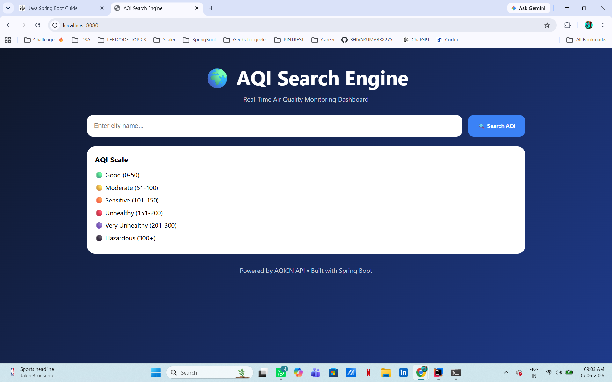
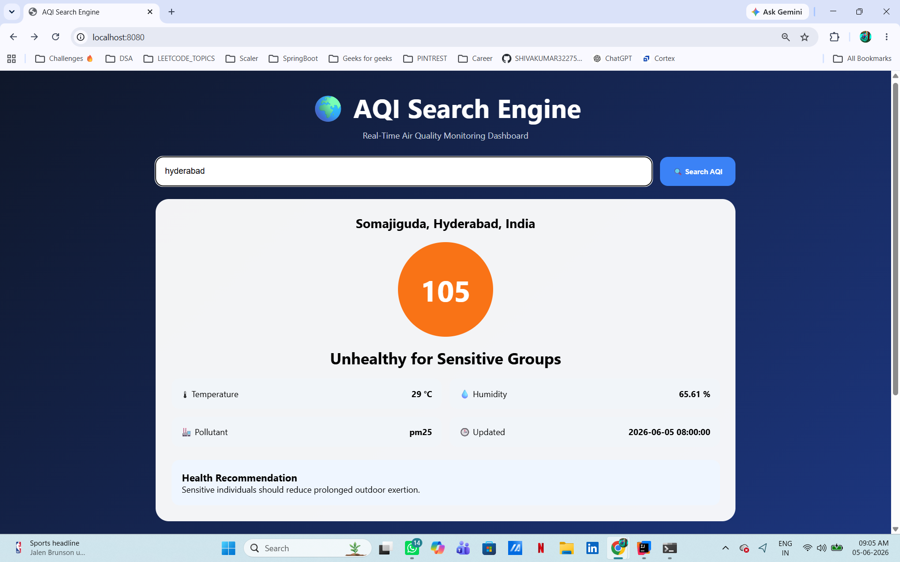
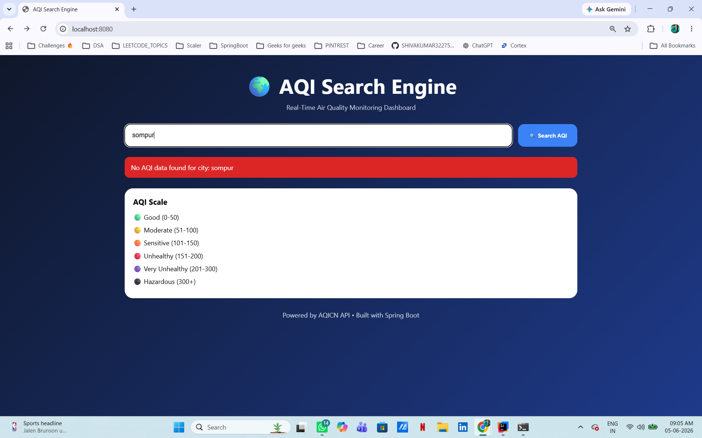

# 🌍 AQI Search Engine

A full-stack Air Quality Index (AQI) Search Engine built using **Java, Spring Boot, HTML, CSS, and JavaScript**. The application enables users to search for any city and view real-time air quality information using the AQICN API.

---

# 🚀 Features

## Backend Features

* RESTful API built using Spring Boot
* AQICN Air Quality API Integration
* Layered Architecture (Controller → Service → Client)
* Global Exception Handling
* Custom Error Responses
* Caffeine Cache Integration
* Cache Expiry Management
* Maximum Cache Size Configuration
* Optimized API Response Handling
* Clean and Extensible Code Structure

## Frontend Features

* Responsive User Interface
* City Search Functionality
* Real-Time AQI Display
* AQI Status Classification
* Temperature Information
* Humidity Information
* Dominant Pollutant Information
* Last Updated Timestamp
* Health Recommendations
* AQI Color Coding
* Error Handling UI

---

# 🏗 Architecture

```text
Frontend (HTML/CSS/JavaScript)
            │
            ▼
Spring Boot Controller
            │
            ▼
Service Layer
            │
            ▼
AQICN Client
            │
            ▼
AQICN API
```

---

# 🛠 Technology Stack

## Backend

* Java 17
* Spring Boot
* Maven
* Caffeine Cache
* Lombok
* Spring Validation

## Frontend

* HTML5
* CSS3
* JavaScript (ES6)

## External API

* AQICN API
* https://aqicn.org/api/

---

# ⚡ Cache Configuration

The application uses **Caffeine Cache** to improve performance and reduce unnecessary vendor API calls.

| Configuration   | Value      |
| --------------- | ---------- |
| Cache Name      | aqi        |
| Maximum Entries | 100        |
| Expiry Time     | 10 Minutes |
| Cache Key       | City Name  |

### Benefits

* Faster repeated searches
* Reduced vendor API usage
* Improved response time
* Better scalability

---

# 🔗 API Endpoint

## Get AQI By City

```http
GET /api/air-quality/city?city=hyderabad
```

### Example Response

```json
{
  "city": "Somajiguda, Hyderabad, India",
  "aqi": 105,
  "dominantPollutant": "pm25",
  "temperature": 29,
  "humidity": 65.61,
  "status": "Unhealthy for Sensitive Groups",
  "lastUpdated": "2026-06-05 08:00:00"
}
```

### Error Response

```json
{
  "message": "No AQI data found for city: invalidcity",
  "timestamp": "2026-06-05T09:00:00"
}
```

---

# ▶ Running The Project

## Clone Repository

```bash
git clone https://github.com/SHIVAKUMAR32275/aqi-search-engine.git
```

## Navigate To Project

```bash
cd aqi-search-engine
```

## Configure API Token

Update the following property inside:

```text
src/main/resources/application.properties
```

Replace:

```properties
aqi.api.token=YOUR_TOKEN
```

with your AQICN API token.

## Run Application

```bash
mvn spring-boot:run
```

Application will be available at:

```text
http://localhost:8080
```

---

# 📸 Screenshots

## Home Page



## AQI Search Result



## Invalid City Error



---

# 🎯 Future Enhancements

* City Autocomplete Search
* AQI Forecast Visualization
* Historical AQI Trends
* Multi-City Comparison
* Dark Mode Support
* Export AQI Reports
* User Search History

---

# 👨‍💻 Author

**Vilasagarapu Shiva Kumar**

GitHub: https://github.com/SHIVAKUMAR32275

---

# 📄 Challenge Submission

This project was developed as part of a **Software Engineer (Java)** coding challenge submission for **Finfactor Technologies**.

---

# 📈 Highlights

* Clean Layered Architecture
* Performance Optimization Using Caching
* Proper Exception Handling
* Extensible Code Structure
* Responsive UI Design
* Real-Time AQI Monitoring
* Production-Oriented Development Practices
